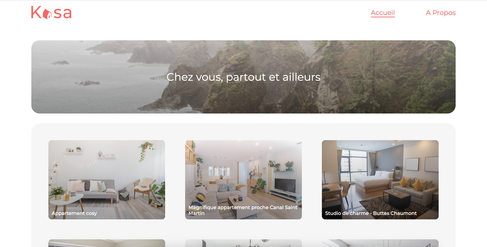
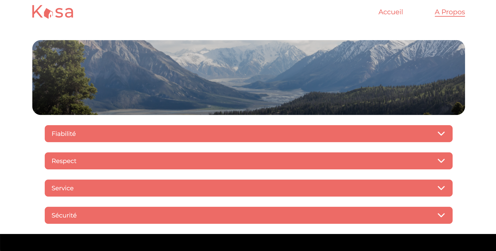
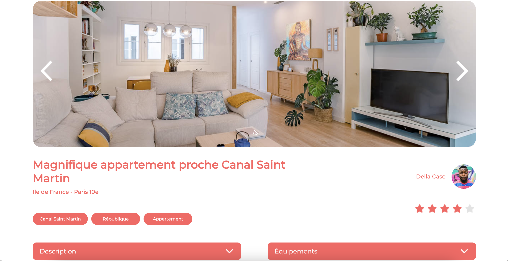
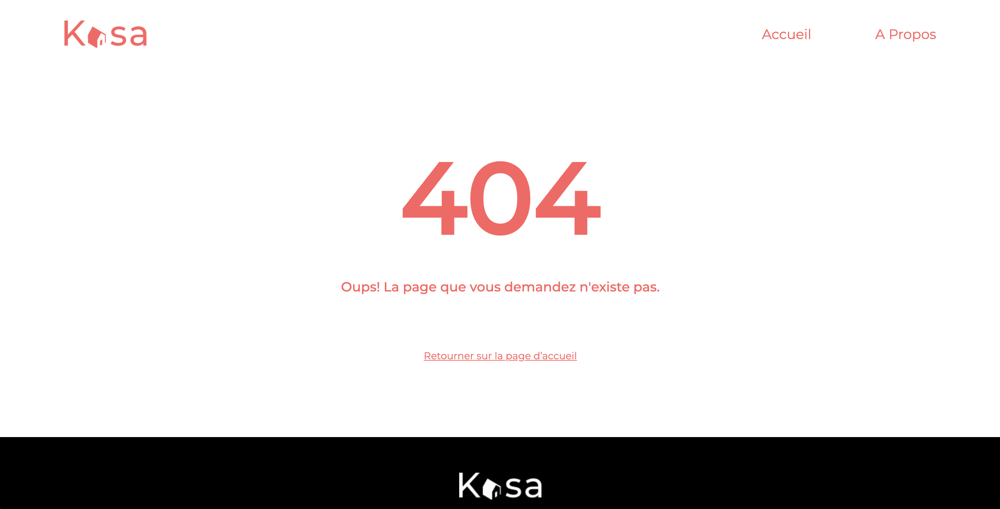

# Getting Started Kasa with Create React App

## `Instructions`

-Fork this repository

-Clone the repository into your computer

-Open a terminal window in the cloned project

-Run the following commands:

#### Install dependencies:

npm install

#### Start the app with:

npm start

Your app KASA should be running at [http://localhost:3000](http://localhost:3000 and will be opened it in your browser.

# Pages of KASA app

## Home page

## About page

## Logement page

## Page error 404`

